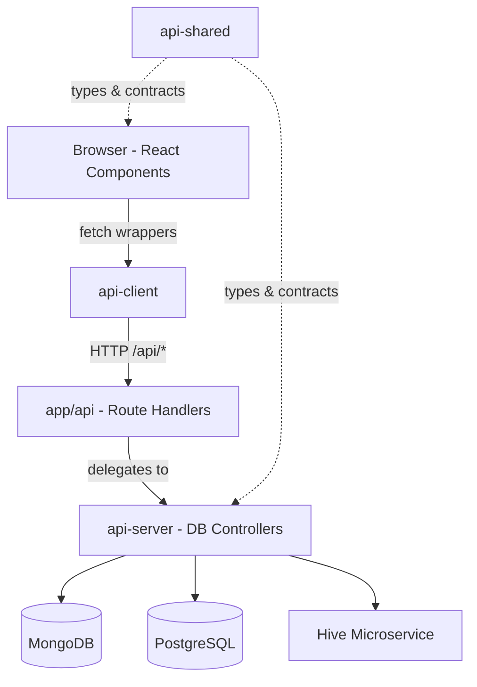
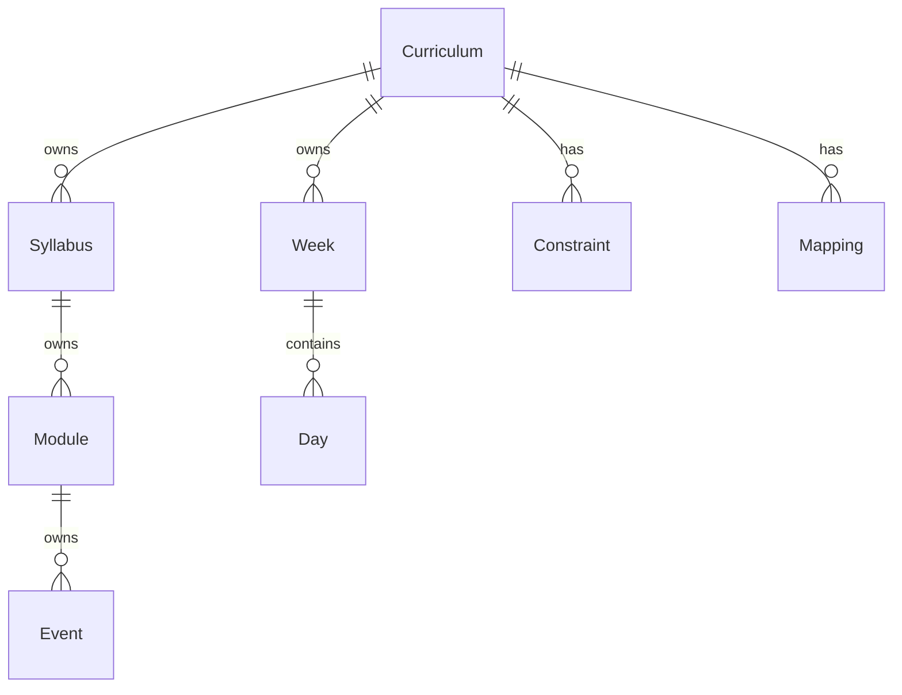

# Architecture

Bluz follows a strict **four-layer API architecture**. Understanding this layering is
essential before making any code changes.

## Data Flow



## The Four Layers

### `ui/src/api-client/` — Browser Fetch Wrappers

- **Runs in**: Browser only
- **Contains**: `fetch()` wrappers that call `/api/*` endpoints
- **Rules**: No database imports, no secrets, no server-only code

### `ui/src/app/api/` — Route Handlers

- **Runs in**: Server (Next.js API routes)
- **Contains**: Thin `route.ts` controllers that validate input and delegate to `api-server`
- **Rules**: No direct DB queries — always delegate to `api-server` controllers

### `ui/src/api-server/` — DB Controllers & Integrations

- **Runs in**: Server only
- **Contains**: MongoDB queries, Drizzle/Postgres queries, Hive client calls
- **Rules**: Never import browser constructs (`window`, `useState`, etc.)

### `ui/src/api-shared/` — Shared Types & Contracts

- **Runs in**: Both browser and server
- **Contains**: TypeScript types, enums, contracts, pure utility functions
- **Rules**: Must be **side-effect-free** — compiles into both bundles

!!! danger "Most Common Mistake"
    Putting code in the wrong layer. A stray browser import in `api-server` or a side
    effect in `api-shared` breaks the build in non-obvious ways.

## Two Databases, Two Engines

| Engine | Database | Purpose |
|---|---|---|
| **Calendar** | MongoDB | Class scheduling, events, prayer times, real-time sync |
| **Gantt** | PostgreSQL (Drizzle ORM) | Curriculum building, syllabus/module/event allocation |

Don't reach for MongoDB in Gantt code or PostgreSQL in Calendar code. The split is
intentional and mirrored throughout the layers.

## Gantt Domain Model



Type definitions: `ui/src/api-shared/types/gantt/models/`
Postgres tables: `ui/src/api-server/gantt/schema/`

## Gantt Collection Routes (Generated)

Most Gantt CRUD endpoints use `buildGantCollectionRoutes()` from
`ui/src/app/api/gantt/base-collection.ts`. Example:

```typescript
export const dynamic = "force-dynamic";
import { DbCurriculum } from "@/api-server/gantt/db-curriculum";
import { buildGantCollectionRoutes } from "@/app/api/gantt/base-collection";

const { GET, POST } = buildGantCollectionRoutes({ dbSet: DbCurriculum });
export { GET, POST };
```

When adding a new Gantt entity, follow this pattern.

## Directory Map

| Path | Role |
|---|---|
| `ui/` | The Next.js application |
| `ui/src/api-client/` | Client-side fetch wrappers |
| `ui/src/app/api/` | API route handlers |
| `ui/src/api-server/` | Server-only DB controllers + Hive integration |
| `ui/src/api-shared/` | Shared types, contracts, pure utilities |
| `ui/src/components/` | React components, hooks, providers, theme |
| `drizzle/` | PostgreSQL migrations (Drizzle Kit) |
| `session-server/` | Standalone WebSocket sync server |
| `scripts/` | Setup, seeding, test-runner, CI helpers |
| `cli/` | Python CLI tool (Typer + InquirerPy) |
| `tests/` | Playwright e2e + Vitest unit/backend tests |
| `nginx/` | Reverse-proxy configs per topology |

## App Router Groups

Route groups encode authentication state:

- `(pre-auth)` — pages before login
- `(post-auth)` — pages after login
- `(with-hive)` — pages requiring Hive connection
- `(themed)` — pages with the full theme provider

## Conventions

- **RTL-first**: The entire app is `dir="rtl"`. Use logical CSS properties (`start`/`end`), not `left`/`right`.
- **Hebrew strings**: Appear directly in components. Don't translate to English.
- **Prettier**: 4-space indent, double quotes, semicolons, trailing commas, LF line endings.
- **Server/client boundary**: Load-bearing. Respect it strictly.
